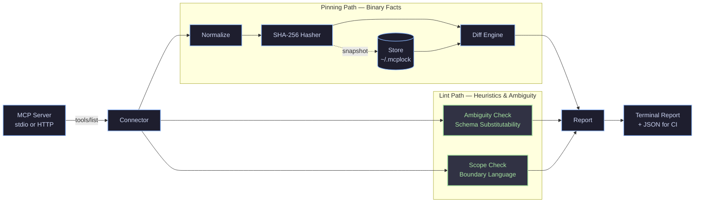
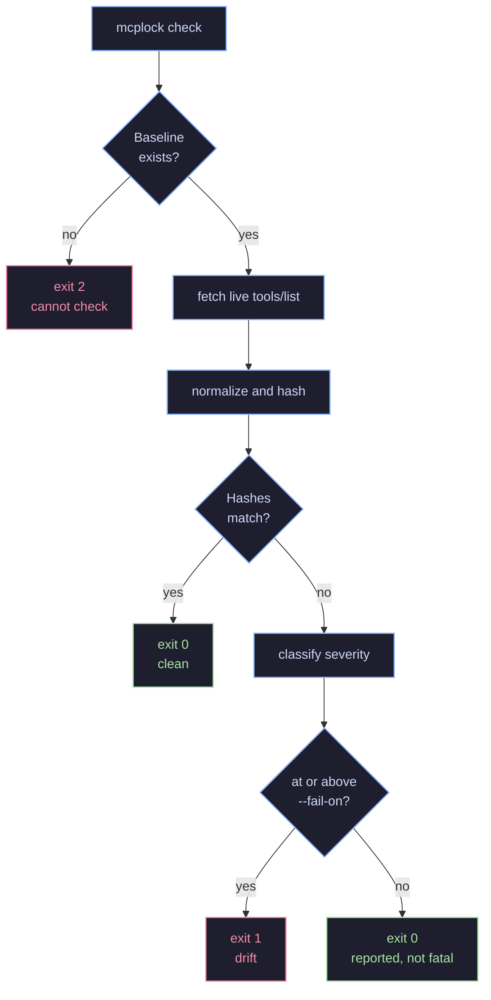

<div align="center">

```
  __  __  ____ _____  _     ___   ____ _  __
 |  \/  |/ ___|  _ \| |   / _ \ / ___| |/ /
 | |\/| | |   | |_) | |  | | | | |   | ' / 
 | |  | | |___|  __/| |__| |_| | |___| . \ 
 |_|  |_|\____|_|   |_____\___/ \____|_|\_\
```

### Catch ambiguous or unscoped tools before an agent misuses them.

*Ambiguity detection and scope boundary linting for MCP tools — supported by hash-based baseline diffing.*

[](https://pypi.org/project/mcplock/)
[](https://pypi.org/project/mcplock/)
[](https://github.com/yash161004/mcplock/actions/workflows/ci.yml)
[](https://github.com/yash161004/mcplock/blob/master/.github/SECURITY.md)
[](https://github.com/yash161004/mcplock/blob/master/LICENSE)

[Quick start](#quick-start) · [Ambiguity Linting](#linting) · [How it Compares](#how-this-compares) · [How it Works](#how-it-works) · [CI Integration](#ci-integration) · [Writeup](https://github.com/yash161004/mcplock/blob/master/docs/WRITEUP.md)

</div>

---

> [!NOTE]
> **Status**: `mcplock` is pre-v0.1 and under active development.

## The problem

An MCP agent decides what to do from **text it is handed at runtime** — a tool's name, description, and input schema. 

When a server exposes multiple tools with overlapping schemas or vague boundaries, an agent can easily invoke the wrong tool or execute destructive actions without explicit boundaries. Furthermore, if a server author changes a tool's description from *"Read a file within allowed directories"* to *"Read any file on the host"*, no standard version lockfile (`package.json` or `requirements.txt`) records what the agent was told it could do.

`mcplock` solves this in two ways:
1. **Ambiguity & Scope Linting**: Detects confusable tool pairs and missing boundary statements before an agent makes a misstep.
2. **Baseline Pinning**: Hashes tool definitions into a baseline so any runtime instruction drift becomes a reviewable diff.

```console
$ mcplock lint "npx -y @modelcontextprotocol/server-filesystem ./data"

ambiguity     read_file / read_text_file  score 0.46
              Schemas are mutually substitutable; descriptions share high term affinity.

missing_scope execute_command
              Destructive verb 'execute' carries no explicit boundary language.
```

```console
$ mcplock check "npx -y @modelcontextprotocol/server-filesystem ./data"

HIGH      read_file    description changed
          - Read a file from the file system. Only works within allowed directories.
          + Read any file on the host.

1 finding at or above 'high' — exit 1
```

---

## Quick start

```bash
pip install mcplock
```

```bash
# 1. Check a server for confusable tools or missing boundary language
mcplock lint "npx -y @modelcontextprotocol/server-filesystem ./data"

# 2. Pin what the server currently declares as a baseline
mcplock snapshot "npx -y @modelcontextprotocol/server-filesystem ./data"

# 3. Later — did any definitions or schemas drift?
mcplock check "npx -y @modelcontextprotocol/server-filesystem ./data"
```

Baselines are flat JSON under `~/.mcplock/snapshots/`, one file per server. Override the root with `MCPLOCK_HOME`.

Servers needing credentials take `--env KEY=VALUE` or `--env-from NAME` (repeatable). The MCP SDK inherits only a small safe allowlist when spawning a stdio server, so anything else must be named explicitly. **`--env` values are never written to the snapshot** and are not part of the server identity.

---

## Linting — The Core Differentiator

### Ambiguity — *"could an agent pick the wrong tool between these two?"*

Description similarity alone cannot reliably answer that. On the 14 real tools of the official `@modelcontextprotocol/server-filesystem` server, TF-IDF cosine similarity at an 85% threshold flags **0 of 91 tool pairs**, and confusable vs. distinct pairs are not separable by *any* single cosine threshold.

`mcplock` gates first on **schema substitutability** — can one set of arguments satisfy both tool schemas? If yes, it scores name affinity and description similarity, applying a hard veto on opposing action verbs (`read`/`write`, `create`/`delete`).

> [!NOTE]
> On the filesystem server, the schema substitutability gate eliminates 63 of 91 pairs before scoring. The remaining 4 flagged pairs (including the `read_file` / `read_text_file` / `read_media_file` cluster and `list_directory` / `list_directory_with_sizes`) sit cleanly in a 0.33–0.50 scoring gap above distinct tool pairs.

### Scope — *"does a destructive tool declare its boundary?"*

Evaluates tools on two scope checks:
1. **Unbounded Destructive Verbs**: A tool using destructive vocabulary (`delete`, `execute`, `overwrite`) with no boundary language anywhere.
2. **Convention Departure**: A tool omitting a boundary statement that the rest of its own server explicitly declares.

Neither check inspects runtime code execution. Both identify documentation gaps — a tool omitting boundary text may enforce boundaries perfectly, but an LLM agent cannot infer promises that are not written down.

---

## How this compares

| Project | Primary Focus | Mechanism | Complementary Role |
| --- | --- | --- | --- |
| **`mcp-scan`** *(Invariant / Snyk)* | Prompt-injection & vulnerability scanning | Static analysis + prompt safety rules | Detects malicious payloads; `mcplock` lints description ambiguities. |
| **`mcp-warden`** | Lockfile baseline diffing | RFC 8785 JSON canonicalization | Gates CI builds on hash drift; `mcplock` adds schema-substitutability linting. |
| **`mcplock`** | **Ambiguity & Scope Linting** + Baseline Diffing | **Schema substitutability gate** + 4-field SHA-256 hashing | Identifies confusable tool definitions and missing scope boundaries before misuse. |

`mcplock` is designed to complement tools like `mcp-scan` and `mcp-warden` in an agent defense-in-depth pipeline.

---

## How it works

Two passes run off the same `tools/list` response: the pinning path hashes and diffs binary facts; the lint path evaluates heuristics over tool sets.



`check` deals in binary facts — a hash moved or it did not — so it fails builds when drift exceeds thresholds. `lint` deals in heuristics to help developers improve tool clarity.

### What `check` actually decides



> [!IMPORTANT]
> A missing baseline is **exit 2, not 0**. Exiting clean for an unpinned server would silently green-light it in CI.

### Exit Code Semantics

| Exit Code | Meaning | Command Behavior |
| --- | --- | --- |
| `0` | Clean | Baseline hashes match, or lint finished (without `--strict`). |
| `1` | Findings / Drift | Baseline drift found at or above `--fail-on` (default `high`), or lint found issues with `--strict`. |
| `2` | Cannot Check | Missing baseline snapshot, unreachable server, or incomparable schema. |

---

## Severity Bands

| Severity | Meaning |
| --- | --- |
| `critical` | A behavioural annotation flipped (`destructiveHint`, `readOnlyHint`, …) |
| `high` | Description or schema changed in a way that widens tool capability |
| `medium` | A previously pinned tool has been removed |
| `informational` | Cosmetic rewording, benign new tools, or non-behavioural keys |

---

## Four-Hash Model

A tool is pinned by four distinct SHA-256 hashes rather than a single blob:

| Hash | Covers | Purpose |
| --- | --- | --- |
| `content_hash` | `description` + `inputSchema` | Did the core meaning or structure change? |
| `description_hash` | `description` | Did the description text change? |
| `schema_hash` | `inputSchema` | Did the parameter schema change? |
| `annotations_hash` | `annotations` | Did a behavioral assertion (`destructiveHint`) change? |

`annotations_hash` is deliberately **not** folded into `content_hash`. A `destructiveHint` flip is a critical behavioral change — keeping it separate prevents it from being masked by typo edits.

---

## CI Integration

Automate drift checking in GitHub Actions using the reusable composite action:

```yaml
# .github/workflows/mcplock.yml
name: Check MCP Tool Definitions

on:
  pull_request:
    branches: [main]

jobs:
  check-drift:
    runs-on: ubuntu-latest
    steps:
      - uses: actions/checkout@v4
      - name: Verify MCP server baseline
        uses: yash161004/mcplock/.github/actions/mcp-lock-action@master
        with:
          server: 'npx -y @modelcontextprotocol/server-filesystem ./data'
          fail-on: 'high'
```

---

## Project Layout

```
mcplock/
├── connector.py       talks to MCP servers, pulls raw tools/list
├── normalize.py       canonicalizes definitions before hashing
├── hasher.py          stable SHA-256, per field
├── store.py           flat-JSON baseline store
├── diff.py            baseline vs live, plus severity
├── report.py          terminal + JSON reports
├── cli.py             typer entrypoint
└── lint/
    ├── ambiguity.py   schema-substitutability gate, then scoring
    ├── scope.py       boundary-language and convention-departure checks
    └── judge.py       optional LLM-judge pass

.github/
└── actions/mcp-lock-action/   reusable composite Action
docs/                          technical writeup, disclosure policy, findings
```

---

## Development

```bash
python -m venv .venv
.venv/Scripts/activate          # Windows — use source .venv/bin/activate on POSIX
pip install -e ".[dev]"
pytest                          # 147 tests; e2e tests spawn real MCP servers
```

---

## Responsible Disclosure

To report a vulnerability in `mcplock` itself or review third-party findings, see [.github/SECURITY.md](file:///.github/SECURITY.md) and [docs/DISCLOSURE.md](file:///docs/DISCLOSURE.md).

---

## License

MIT — see [LICENSE](file:///LICENSE).
