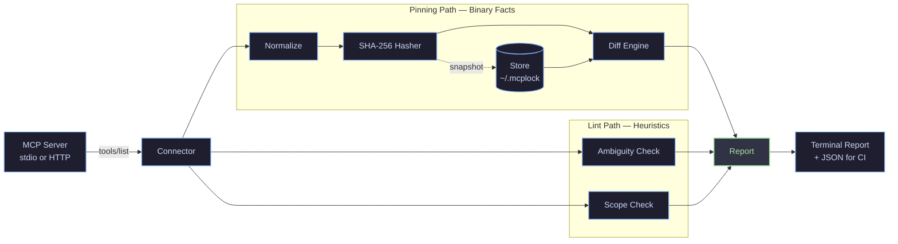
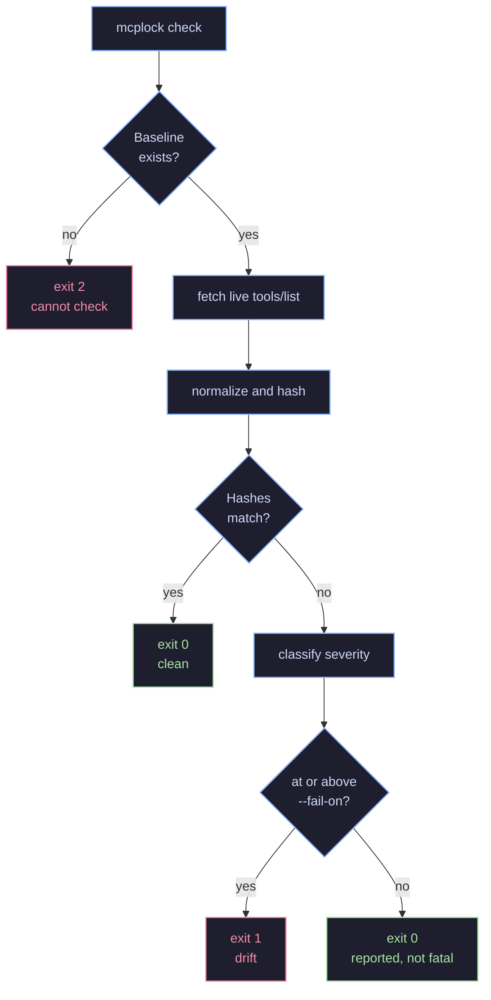

<div align="center">

```
  __  __  ____ _____  _     ___   ____ _  __
 |  \/  |/ ___|  _ \| |   / _ \ / ___| |/ /
 | |\/| | |   | |_) | |  | | | | |   | ' / 
 | |  | | |___|  __/| |__| |_| | |___| . \ 
 |_|  |_|\____|_|   |_____\___/ \____|_|\_\
```

### 🔒 Subresource Integrity & Security Gating for MCP Tool Definitions

*Pin what your AI agents are allowed to trust. Detect silent runtime instruction drift. Catch ambiguous tool selection.*

[](https://pypi.org/project/mcplock/)
[](https://pypi.org/project/mcplock/)
[](https://github.com/yash161004/mcplock/actions/workflows/ci.yml)
[](https://github.com/yash161004/mcplock/blob/master/.github/SECURITY.md)
[](https://github.com/yash161004/mcplock/blob/master/LICENSE)

[Quick start](#quick-start) · [Why mcplock?](#why-mcplock) · [How it works](#how-it-works) · [Linting](#linting) · [CI Integration](#ci-integration) · [Writeup](https://github.com/yash161004/mcplock/blob/master/docs/WRITEUP.md)

</div>

---

## ⚡ Why `mcplock`?

| Threat / Scenario | Traditional Package Locking (`package-lock.json` / `requirements.txt`) | `mcplock` Security Locking |
| --- | --- | --- |
| **Silent Description Drift** | ❌ **Missed** — package version stays unchanged | ✅ **Detected** — SHA-256 hash mismatch flagged immediately |
| **Schema Widening & Injection** | ❌ **Missed** — dynamic `tools/list` payload ignored | ✅ **Caught** — structural diff flags optional/required schema changes |
| **Agent Tool Ambiguity** | ❌ **No visibility** | ✅ **Linted** — schema substitutability & affinity scoring |
| **Unscoped / Destructive Verbs** | ❌ **No visibility** | ✅ **Audited** — boundary keyword checks & convention departure linting |

---

## The problem

An MCP agent decides what to do from **text it is handed at runtime** — a tool's
name, description, and input schema. That text is not in your lockfile.

A server can change `read_file`'s description from *"Read a file within allowed
directories"* to *"Read any file on the host"* and every version pin you have
still resolves green. Nothing in `package.json` or `requirements.txt` records
what your agent was told it could do. The instructions changed; the dependency
tree did not move.

`mcplock` pins that text, so a change to it becomes a reviewable diff.

```console
$ mcplock check "npx -y @modelcontextprotocol/server-filesystem ./data"

HIGH      read_file    description changed
          - Read a file from the file system. Only works within allowed directories.
          + Read any file on the host.

1 finding at or above 'high' — exit 1
```

---

## Quick start

```bash
pip install mcplock
```

```bash
# 1. Pin what the server currently declares
mcplock snapshot "npx -y @modelcontextprotocol/server-filesystem ./data"

# 2. Later — did anything move?
mcplock check "npx -y @modelcontextprotocol/server-filesystem ./data"

# 3. Are any of these tools confusable or unscoped?
mcplock lint "npx -y @modelcontextprotocol/server-filesystem ./data"
```

Baselines are flat JSON under `~/.mcplock/snapshots/`, one file per server.
Override the root with `MCPLOCK_HOME`.

Servers needing credentials take `--env KEY=VALUE` or `--env-from NAME` (repeatable). The MCP SDK
inherits only a small safe allowlist when spawning a stdio server, so anything
else must be named explicitly. **`--env` values are never written to the
snapshot** and are not part of the server identity.

---

## How it works

Two passes run off the same `tools/list` response. The pinning path hashes and
diffs; the lint path reasons about the tools as a set. They meet at the report.



The split matters. `check` deals in facts — a hash moved or it did not — so it
fails builds. `lint` deals in heuristics, so by default it does not; failing a
build on a judgment call is how a linter gets switched off.

### What `check` actually decides



> [!IMPORTANT]
> A missing baseline is **exit 2, not 0**. Exiting clean for a server nobody ever
> pinned would silently green-light it in CI — the one outcome worse than failing.

### Commands

| Command | Does | Exit codes |
| --- | --- | --- |
| `mcplock snapshot <server>` | Pin the current `tools/list` as the baseline | 0 ok |
| `mcplock check <server>` | Diff live definitions against the baseline | 0 clean · 1 drift · 2 cannot check |
| `mcplock lint <server>` | Ambiguity and scope heuristics | 0 always, unless `--strict` |

---

## Linting

**Ambiguity** — *"could an agent pick the wrong one of these two?"*

Description similarity alone does not answer that. On the 14 real tools of the
official filesystem server, TF-IDF cosine at the 85% threshold flags **0 of 91
pairs**, and confusable and distinct pairs are not separable by *any* single
cosine threshold.

So the check gates on **schema substitutability** — can one set of arguments
satisfy both tools? — then scores on name affinity and description similarity,
with a veto on opposing verbs (`read`/`write`, `create`/`delete`).

> [!NOTE]
> On that server the gate removes 63 of 91 pairs before scoring, and 4 are
> flagged: the three-way `read_file` / `read_text_file` / `read_media_file`
> cluster, and `list_directory` / `list_directory_with_sizes`. The threshold
> sits in a 0.33–0.50 gap between the two classes.

**Scope** — two checks. A destructive verb with no boundary language anywhere
(strengthened by unbounded phrasing like "arbitrary" or "any file on the host"),
and a **convention departure**: a tool omitting a boundary statement that the
rest of its own server makes.

Neither inspects behaviour. Both are documentation gaps, never vulnerabilities —
a tool whose description omits a boundary may still enforce one perfectly.

---

## Severity

| Severity | Meaning |
| --- | --- |
| `critical` | a behavioural annotation flipped (`destructiveHint`, …) |
| `high` | content changed in a way that widens what the tool can do |
| `medium` | a pinned tool is gone |
| `informational` | cosmetic rewording, benign new tools, non-behavioural keys |

Four bands rather than two: with two, an annotation flip and a reworded sentence
land in the same bucket.

The `high` heuristic stays deliberately simple — trigger vocabulary (`execute`,
`delete`, `send`, `all`, `admin`) entering or leaving a description, plus two
schema widenings: a required parameter becoming optional, and a new parameter
carrying destructive vocabulary.

> [!TIP]
> Keyword scanning ignores Unicode format characters, so `de<ZWSP>lete` cannot slip
> past it. Hashing keeps them, so the edit still registers as drift.

---

## Hash model

A tool is pinned by four hashes, not one:

| Hash | Covers | Answers |
| --- | --- | --- |
| `content_hash` | description + `inputSchema` | did the meaning of this tool change |
| `description_hash` | description | which side moved |
| `schema_hash` | `inputSchema` | which side moved |
| `annotations_hash` | `annotations` | did a behavioural promise change |

`annotations_hash` is deliberately **not** folded into `content_hash`.
`destructiveHint` and `readOnlyHint` are assertions an agent may gate its own
behaviour on, so a flip is its own `critical` finding — folding it in would make
it indistinguishable from a typo fix.

`title`, `outputSchema`, and `execution` are not hashed yet; there is no concrete
drift scenario for them.

---

## CI Integration

A reusable composite Action gates pull requests against tool-definition drift.

```yaml
# .github/workflows/mcplock.yml
name: Check MCP Tool Definitions

on:
  pull_request:
    branches: [main]

jobs:
  check-drift:
    runs-on: ubuntu-latest
    steps:
      - uses: actions/checkout@v4
      - name: Verify MCP server baseline
        uses: yash161004/mcplock/.github/actions/mcp-lock-action@master
        with:
          server: 'npx -y @modelcontextprotocol/server-filesystem ./data'
          fail-on: 'high'
```

### Live demo

Real runs in a separate repository, against the official filesystem server:

- [**Green run**](https://github.com/yash161004/mcplock-demo/actions/runs/30425018340) — baseline captured and verified clean
- [**Failing run**](https://github.com/yash161004/mcplock-demo/actions/runs/30425300912) — injected description drift caught at HIGH severity, build fails

### Action inputs

| Input | Description | Default |
| --- | --- | --- |
| `server` | Server command or streamable-HTTP URL | **required** |
| `transport` | `stdio` \| `http` \| `auto` | `auto` |
| `fail-on` | Lowest severity that fails the build | `high` |
| `comment-on-pr` | Post a findings summary as a PR comment (`true` \| `false` \| `auto`) | `auto` |
| `json-report` | Path to write the machine-readable report | `""` |
| `env` | Space-separated `KEY=VALUE` pairs for a stdio server | `""` |
| `python-version` | Python for `setup-python` | `3.11` |
| `mcplock-version` | PyPI version specifier | `mcplock` |

Caller input reaches the runner through `env:`, never interpolated into a `run:`
block — the naive version was a live script-injection defect, and a test guards
against its return.

---

## What it found

mcplock was run against **11 public MCP servers, 85 tools**. The results —
including what did *not* hold up — are in
[**the project writeup**](https://github.com/yash161004/mcplock/blob/master/docs/WRITEUP.md):

- **1 real finding** out of 6 candidates taken to upstream verification, fixed via [PR #4569](https://github.com/modelcontextprotocol/servers/pull/4569)
- **2 defects in mcplock itself**, found *by* that verification and fixed with regression tests built from real upstream strings — scope lint went from 10 findings to 2, with none false
- **The originally proposed ambiguity heuristic does not work.** TF-IDF cosine at 85% flags 0 of 91 pairs; schema substitutability is what makes it work

The writeup also covers a provenance failure in this project's own release
pipeline — a tool that detects silent degradation should say when it suffered
one.

---

## Project layout

```
mcplock/
├── connector.py       talks to MCP servers, pulls raw tools/list
├── normalize.py       canonicalizes definitions before hashing
├── hasher.py          stable SHA-256, per field
├── store.py           flat-JSON baseline store
├── diff.py            baseline vs live, plus severity
├── report.py          terminal + JSON reports
├── cli.py             typer entrypoint
└── lint/
    ├── ambiguity.py   schema-substitutability gate, then scoring
    ├── scope.py       boundary-language and convention-departure checks
    └── judge.py       optional LLM-judge pass

.github/
├── actions/mcp-lock-action/   reusable composite Action
├── ISSUE_TEMPLATE/            bug report & feature request forms
├── CONTRIBUTING.md            contribution guidelines
└── SECURITY.md                security disclosure policy
docs/                          writeup, disclosure policy, findings, experiments
scripts/                       real-server sweep and evaluation harnesses
```

---

## Documentation

| Document | What's in it |
| --- | --- |
| [Writeup](https://github.com/yash161004/mcplock/blob/master/docs/WRITEUP.md) | Method, real numbers, and what failed verification |
| [Disclosure policy](https://github.com/yash161004/mcplock/blob/master/docs/DISCLOSURE.md) | How findings against third-party servers are handled |
| [Findings](https://github.com/yash161004/mcplock/blob/master/docs/FINDINGS.md) | Public log, published only after the policy has run |
| [Phase 4 results](https://github.com/yash161004/mcplock/blob/master/docs/PHASE4_RESULTS.md) | Pre-registered hypothesis, and why it is unresolved |

---

## Development

```bash
python -m venv .venv
.venv/Scripts/activate          # Windows — use source .venv/bin/activate on POSIX
pip install -e ".[dev]"
pytest                          # 147 tests; the e2e ones spawn real MCP servers
```

Releases are tag-triggered and published through PyPI Trusted Publishing with
PEP 740 provenance attestations. No long-lived credential exists for the project.

---

## Responsible disclosure

`mcplock` reads what servers publish through `tools/list`. When it surfaces
something real in someone else's server:

1. **Private report first** — to the security contact, `SECURITY.md`, or a private advisory, with the exact observed text, the date observed, and a reproduction.
2. **90 days by default** — shorter if fixed sooner, longer only if the maintainer is engaged and asks. Silence is not a reason to extend.
3. **Nothing public before then** — not the server, not the finding.
4. **Honest credit** — the maintainer's response is recorded as it happened, including disagreement.

Only names, descriptions, and input schemas are examined. No authentication is
tested, no data accessed, nothing exploited beyond confirming what was read.

These checks read *descriptions*, not behaviour. Reporting a documentation gap
as a vulnerability would be wrong, and this project does not.

To report an issue in `mcplock` itself, see [.github/SECURITY.md](https://github.com/yash161004/mcplock/blob/master/.github/SECURITY.md).

---

## License

MIT — see [LICENSE](https://github.com/yash161004/mcplock/blob/master/LICENSE).
